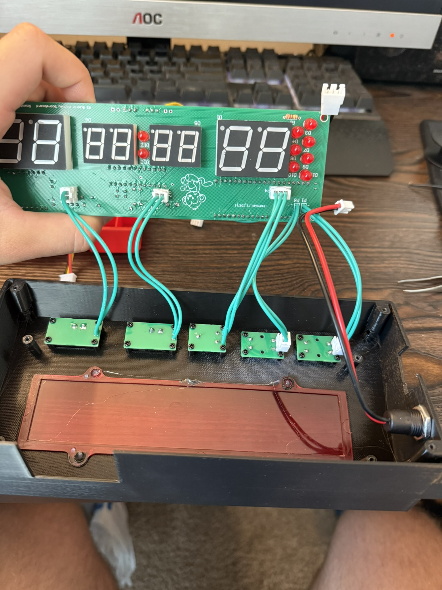

# Bubble Hockey Scoreboard

  
[🎥 Video Demo](https://youtu.be/nwzQTY0Y3hk)

## Overview
A fully custom scoreboard for a bubble hockey table (or any goal-based game), built from schematic design to a finished 3D-printed enclosure. Tracks goals automatically, plays audio cues, and supports multiple game modes.  
Includes two versions:
- **V1** – PCB-only prototype for a class project
- **V2** – Redesigned, fully integrated product with mechanical housing

## Features
- Automatic goal detection via beam-break sensors
- Multiple game modes (play to score limit or timed matches)
- Ambient lighting with NeoPixel LEDs
- Audio effects via DFPlayer Mini MP3 player
- Modular design with Molex connectors for easy assembly/disassembly

## Tech Stack / Components
- **MCU:** Raspberry Pi Pico 2
- **Display:** MAX7219-driven 7-segment LEDs
- **Lighting:** NeoPixel LEDs (FastLED library)
- **Audio:** DFPlayer Mini + external amp
- **Enclosure:** Custom 3D-printed case with mounting hardware
- **Other:** Beam-break sensors, tactile buttons, toggle switches, potentiometer

## Design Notes
- Learned to integrate mechanical constraints into PCB design
- Balanced routing efficiency with component placement for enclosure fit
- Iterated enclosure to allow access to key ports while assembled

## Future Improvements
- Better speaker and button hole tolerances in the case
- Integrate light switch state detection directly into firmware
- Correct PCB LED footprint for better fit

## Media
- [Video Demo](https://youtu.be/nwzQTY0Y3hk)
